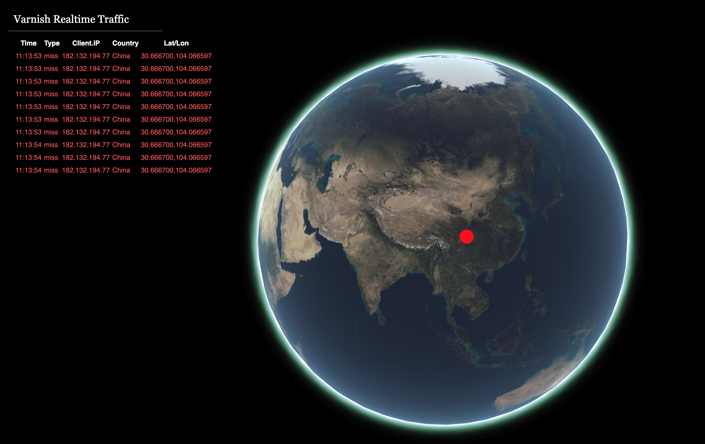

# Varnish Visualizer 3D

Visualize cache hits/misses in a Varnish cache. It uses VCL and two VMODs to do this.

Required VMODs:
- RabbitMQ: https://github.com/Lallassu/libvmod-rmq.git
- GeoIP(with lat/long support): https://github.com/Lallassu/libvmod-geoip.git

Developed for Varnish 5.2.x and not for production!

Required a default installation of RabbitMQ and Varnish.

## VCL Used
    vcl 4.0;
    import geoip;
    import rmq;
    
    backend default {
        .host = "127.0.0.1";
        .port = "8888";
    }
    
    sub vcl_init {
            rmq.init("localhost", 5672, "test", "guest", "guest");
    }
    
    sub vcl_recv {
    	unset req.http.Cookie;
    }
    
    sub vcl_hit {
    	rmq.send(client.ip, geoip.country_name(client.ip), geoip.latlong(client.ip), "hit");
    }
    
    sub vcl_pass {
    	rmq.send(client.ip, geoip.country_name(client.ip), geoip.latlong(client.ip), "miss");
    }

## Screenshot

## License
MIT

